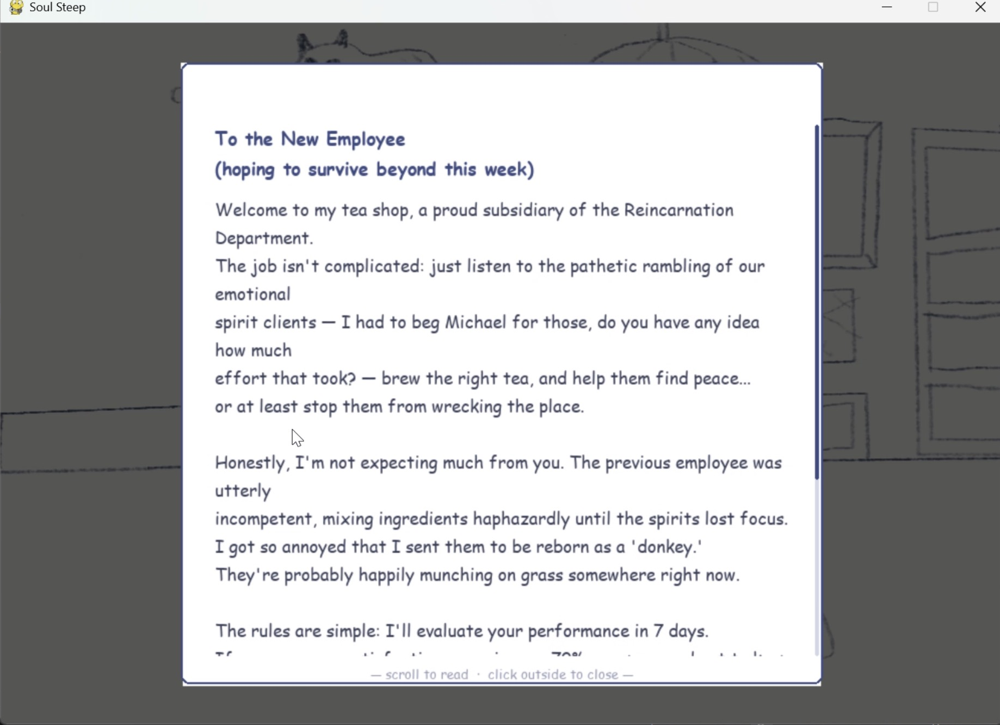
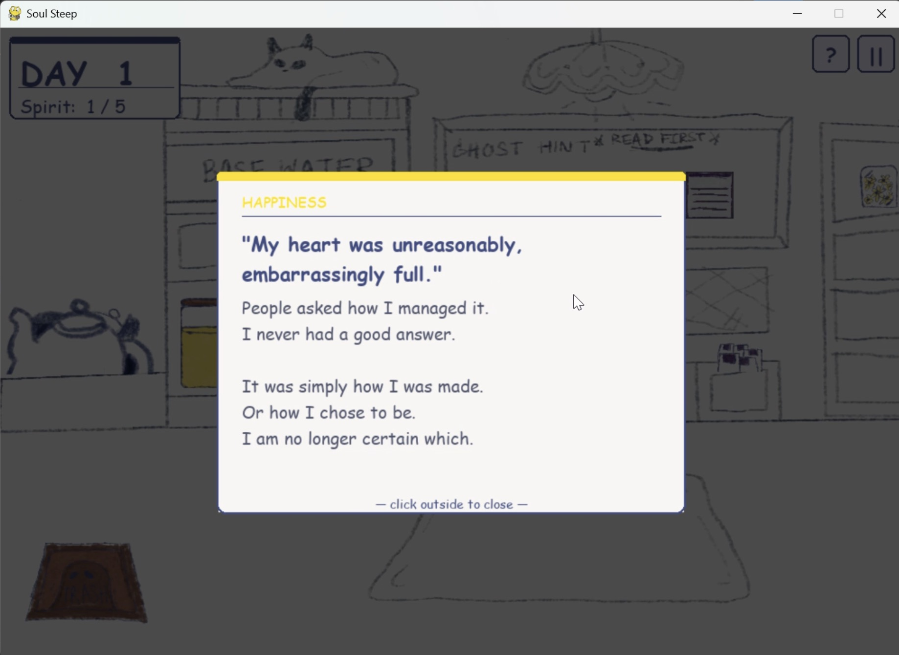
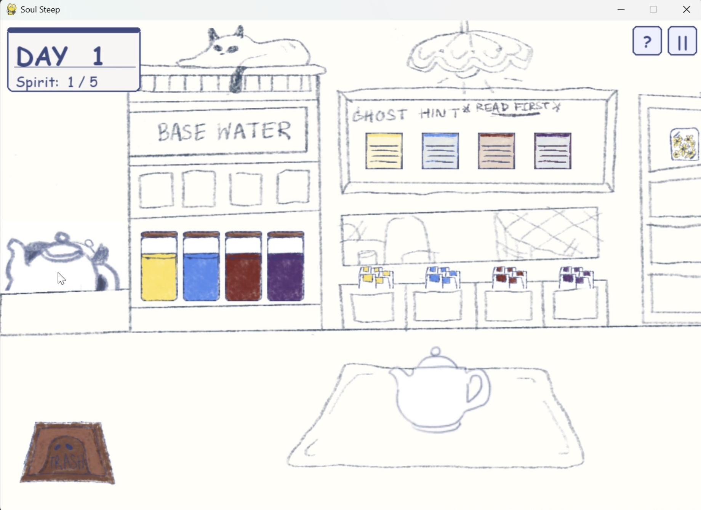
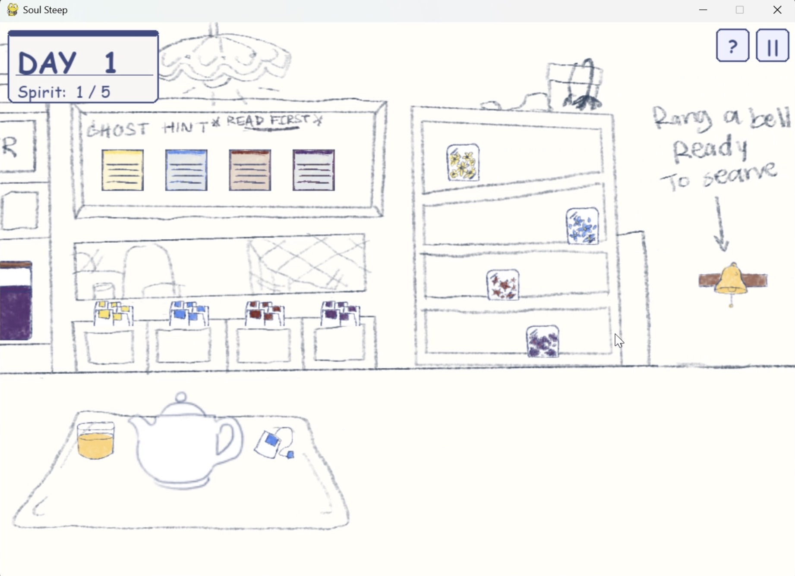
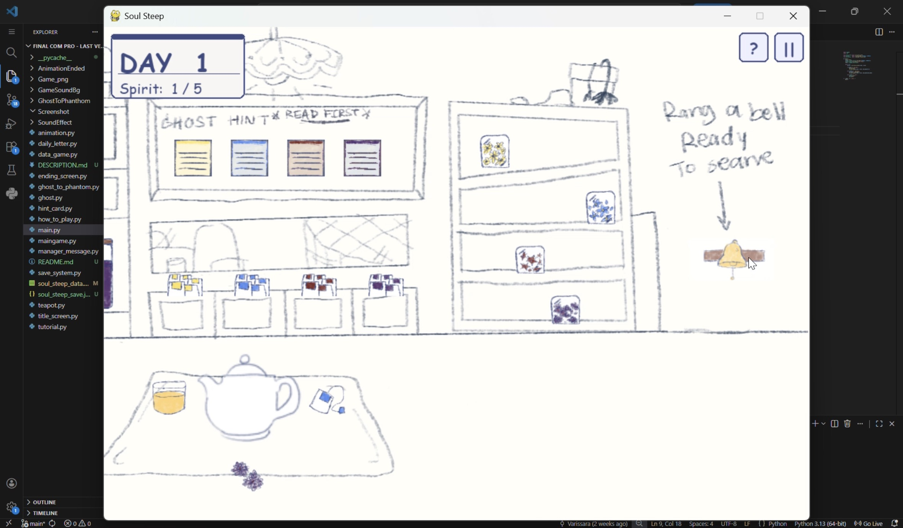
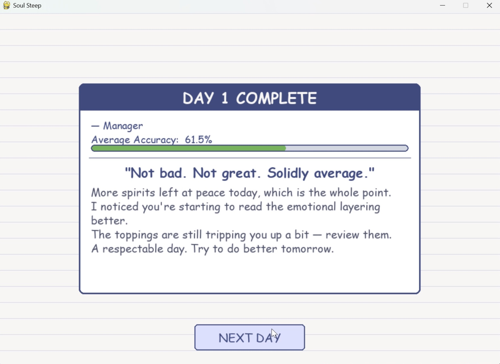
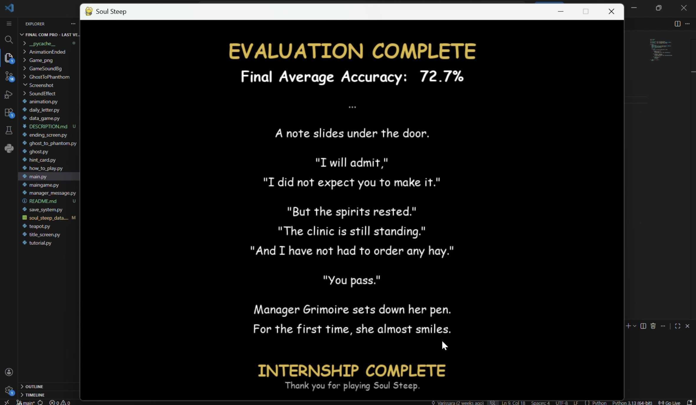

# Project Description

## 1. Project Overview

- **Project Name:** Soul Steep: An Intern's Trial

- **Brief Description:**
  Soul Steep is a simulation and narrative game in which the player takes the role of a newly deceased intern at a mysterious afterlife tea shop, managed by the sharp-tongued Manager Grimoire. Over 7 in-game days, restless spirits arrive one by one, each carrying unresolved emotions. The player must read cryptic diary fragments written by each spirit, diagnose their emotional state, and brew a personalised therapeutic tea using a three-step ingredient system — choosing a Base Water, a Tea Bag, and a Topping — each of which carries a real numerical impact on the final brew.

  The game is built in Python using the pygame library for the interactive game window, and tkinter with matplotlib for a separate data dashboard. Player actions are logged to a CSV file across multiple sessions, enabling data analysis of brewing accuracy, diagnostic time, ingredient choices, interaction frequency, and daily success rate.

- **Problem Statement:**
  Simple order-fulfillment games lack meaningful decision-making depth. Soul Steep replaces surface-level mechanics with an emotional diagnosis system where every brewing choice has measurable consequences, transforming a casual format into a purposeful, emotionally driven experience with a defined performance evaluation.

- **Target Users:**
  - Casual gamers who enjoy narrative-driven simulation games
  - Players interested in puzzle mechanics involving interpretation and strategy
  - Researchers or students analysing player behaviour data through the built-in dashboard

- **Key Features:**
  - Emotional diagnosis system — read ghost diary fragments and infer hidden emotion levels (5, 10, 20, or 30) across four emotions: Happiness, Sadness, Anger, and Fear
  - Three-step brewing system — select Base Water (+30), Tea Bag (+20), and Topping (+10/+5 cross-effect) to match the ghost's emotional profile
  - 7-day internship loop with performance evaluation — serve 5 spirits per day and maintain an average Accuracy above 70% to pass
  - Two endings — Pass or Fail — determined by overall average accuracy across all 35 spirits served
  - In-game data dashboard — visualises 5 gameplay metrics across sessions using interactive charts

- **Screenshots:**

- **YouTube Presentation:** *https://youtu.be/lTbzYgkTerw*
- **Proposal:** [View Original Proposal](proposal.pdf)

---

## 2. Concept

### 2.1 Background

The project draws inspiration from two sources. The gameplay format was inspired by Good Coffee, Great Coffee (TapBlaze), a mobile game built around simple order-fulfillment. Soul Steep replaces that with emotional diagnosis — requiring the player to interpret literary clues and infer hidden values before making any brewing decision.

The concept of tea as a medium for helping souls transition peacefully was inspired by Under the Whispering Door by TJ Klune, a novel in which a tea shop serves as a waystation between the living world and the afterlife. That setting formed the narrative foundation of Soul Steep's world.

The afterlife setting was chosen to justify the unusual premise naturally: spirits carry emotional unfinished business, and tea is the therapeutic medium used to resolve it. The sarcastic manager character, who writes a daily letter to the player, provides narrative continuity and raises the stakes through the threat of a bad evaluation.

The project also serves a data collection purpose — player behaviour across multiple sessions is recorded to a CSV file, enabling analysis of skill development, UI clarity, ingredient balance, and difficulty calibration.

### 2.2 Objectives

- Allow players to practise interpretive reasoning by inferring numerical emotion levels from literary clues rather than explicit information
- Implement a brewing system where all three ingredient choices carry genuine numerical consequences and affect the accuracy score
- Create a 7-day narrative arc with a defined pass/fail outcome to give the gameplay loop meaningful stakes
- Collect structured gameplay data (accuracy, duration, clicks, ingredient selections) across multiple sessions for statistical analysis
- Provide an interactive data dashboard that displays trends and distributions across all recorded sessions

---

## 3. UML Class Diagram

[UML PDF version](./UML _Soul_Steep.pdf)

Key classes and relationships included in the diagram:

- `Ghost` — stores emotional attributes; associated with `GHOST_CLUES` content library
- `Teapot` — tracks brewing state and accumulates emotional stats from ingredients
- `BrewingAnimation` — manages frame-by-frame brewing animation
- `GhostToPhantomAnimation` — manages ghost departure animation with sound
- `SoundManager` — controls background music tracks and volume
- `WarningSystem` — displays timed on-screen warning messages
- `HUD` — renders the day and spirit counter overlay
- `IconButton` / `TitleButton` — reusable clickable UI button components
- `SoulSteepDashboard` — tkinter dashboard class for data visualisation

---

## 4. Object-Oriented Programming Implementation

- **`Ghost`** (`ghost.py`) — Represents a spirit customer. Randomly assigns the four fixed emotion values {5, 10, 20, 30} across Happiness, Sadness, Anger, and Fear using a linked-pair system that ensures thematic coherence. Provides `get_hint_clue()` which returns a randomly selected diary fragment from a library of 160 hand-written entries, and `get_hint_card_path()` for the corresponding image asset.

- **`Teapot`** (`teapot.py`) — Controls the three-step brewing process and accumulates emotional stat values based on ingredient choices. Enforces brewing order (water → teabag → topping), validates input types, updates a visual path string for kettle image rendering, and exposes an `is_complete` property used by the submit logic.

- **`BrewingAnimation`** (`animation.py`) — Loads PNG frames from a folder, scales them to fit the screen, and plays them at a configurable FPS within the 60fps game loop. Includes a SKIP button with hover state and a dark overlay. Supports lazy loading so assets are only read from disk when first needed.

- **`GhostToPhantomAnimation`** (`ghost_to_phantom.py`) — Plays a 7-frame fullscreen ghost departure animation with an accompanying sound effect. Triggered when a brew accuracy score falls below 10%, indicating the spirit became a phantom rather than passing on peacefully.

- **`SoundManager`** (`maingame.py`) — Controls background music across three tracks (main, calm, tense). Selects the active track dynamically based on the player's running average accuracy. Prevents redundant reloads if the correct track is already playing. Exposes volume control used by the pause menu slider.

- **`WarningSystem`** (`maingame.py`) — Displays a timed, fading warning card on screen (e.g. "Create a teapot first!") triggered by invalid player actions. Alpha fades out over the final 40 frames of its 120-frame lifetime.

- **`HUD`** (`maingame.py`) — Renders the day counter and spirit progress indicator as a persistent card in the top-left corner of the game screen.

- **`IconButton`** (`maingame.py`) — A compact reusable button class used for the pause (‖) and how-to-play (?) buttons. Renders with hover highlight and exposes a `clicked()` method for event checking.

- **`TitleButton`** (`title_screen.py`) — A wider button class used on the title screen. Built dynamically from a list of label/action pairs; the Continue and Statistic buttons only appear if a save file or data file exists respectively.

- **`SoulSteepDashboard`** (`data_game.py`) — A tkinter GUI class that loads `soul_steep_data.csv`, computes descriptive statistics, and renders one of five matplotlib charts based on the selected feature and session filter. Charts are rendered offscreen as PNG and displayed inline using PIL/ImageTk.

---

## 5. Statistical Data

### 5.1 Data Recording Method

Player data is recorded automatically to a CSV file (`soul_steep_data.csv`) via the `log_game_data()` function in `maingame.py`. One row is written each time the player submits a completed brew. The file uses append mode so data accumulates across sessions without overwriting prior records. Each row includes a session ID (timestamp-based), day, ghost number, accuracy score, all three ingredient choices, diagnostic duration in seconds, click count, and a full timestamp.

### 5.2 Data Features

| Feature | Description | Graph Type |
|---|---|---|
| **Brewing Accuracy** | Accuracy score (0–100%) per ghost, calculated by comparing brew stats to ghost emotion values | Scatter plot — ghost number vs accuracy, coloured pass/fail |
| **Diagnostic Duration** | Time in seconds from ghost spawn to brew submission; outliers above 300s are excluded | Line graph — ghost number vs time (learning curve) |
| **Interaction Frequency** | Total mouse clicks per ghost per day, including ingredient selections and hint reads | Boxplot — click count distribution by day |
| **Ingredient Selection** | Count of each emotion type (H/S/A/F) selected per slot (Water, TeaBag, Topping) across all sessions | Grouped bar chart — emotion vs usage count, grouped by slot |
| **Daily Success Rate** | Average accuracy per day across all sessions, plotted against the 70% pass threshold | Line graph — day vs average accuracy |

All five features report Range, Mode, Mean, and Median in the dashboard's descriptive statistics panel. The session filter dropdown allows analysis per session or across all sessions combined.

---

## 6. Changed Proposed Features

**Class & Architecture Changes**

| Proposed | Final Implementation | Reason for Change |
|---|---|---|
| `Class IngredientStation` | Removed — click handling done directly in `handle_click()` | A dedicated class added unnecessary indirection; direct rect-based hit detection was simpler and sufficient |
| `Class GameManager` | Removed — replaced by a `state` dictionary in `maingame.py` | A single-instance manager class offered no advantage over a plain dict for this scope |
| `Class DataLogger` | Replaced by `log_game_data()` function | A stateless function was sufficient; no instance state was needed between log calls |
| `Class UIManager` | Replaced by individual screen functions (`run_title_screen`, `run_daily_letter`, etc.) | Function-per-screen is more readable and easier to maintain than a centralised scene manager for a fixed set of screens |
| 34 total ghosts | 35 total ghosts (5 per day × 7 days) | Corrected to an even 5-per-day quota for consistent daily pacing |
| `BrewingAnimator` with 10s countdown | `BrewingAnimation` with frame-based playback and skip button | A countdown bar was replaced with a more engaging sprite animation; skip was added for player convenience |

**Graph & Visualisation Changes**

| Proposed | Final Implementation | Reason for Change |
|---|---|---|
| Ingredient Selection — simple bar chart (ingredient vs usage count) | Grouped bar chart split by slot (Water/TeaBag/Topping) with hatch patterns and value labels | Shows which emotions players prioritise at each brewing step, not just overall popularity |
| Interaction Frequency — boxplot by ghost ID | Boxplot grouped by day | Day-based grouping better shows how clicking behaviour changes over time as players learn |
| Brewing Accuracy — scatter plot | Scatter plot + pass/fail colour coding + 70% threshold line | Visual pass/fail distinction makes performance gaps immediately readable |
| Diagnostic Duration — line graph | Line graph + scatter point overlay + shaded fill + outlier removal (>300s) | Outlier removal prevents extreme AFK sessions from distorting the learning curve; fill and points improve readability |
| Daily Success Rate — line graph | Line graph + shaded fill + per-day coloured dots (green/red) + 70% threshold line | Threshold line directly shows pass/fail boundary; coloured dots give instant day-by-day result |

---

## 7. External Sources

### Music
| Track | Artist | License | Link |
|---|---|---|---|
| Hyperfun | Kevin MacLeod | CC BY 4.0 | https://youtu.be/Vugj1cii9Y0 |
| Source d'Amour | Arthur-Marie Brillouin | CC BY-NC-SA 3.0 | https://youtu.be/BtOc2Uo46hI |
| Winter Waltz | Scott Buckley | CC BY 4.0 | https://youtu.be/FdjMtzmVOGI |

### Sound Effects
| File | Creator | License | Link |
|---|---|---|---|
| 611675__genel__sprinkle.wav | genel | Creative Commons | https://freesound.org/s/611675/ |

### Libraries & Frameworks
| Library | Purpose |
|---|---|
| `pygame` | Game window, rendering, input, audio |
| `tkinter` / `ttk` | Data dashboard GUI |
| `matplotlib` | Chart rendering in dashboard |
| `PIL` / `Pillow` | Image display in tkinter dashboard |
| `numpy` | Bar chart positioning calculations |
| `csv`, `json`, `os`, `datetime` | Data logging, save system, file management |