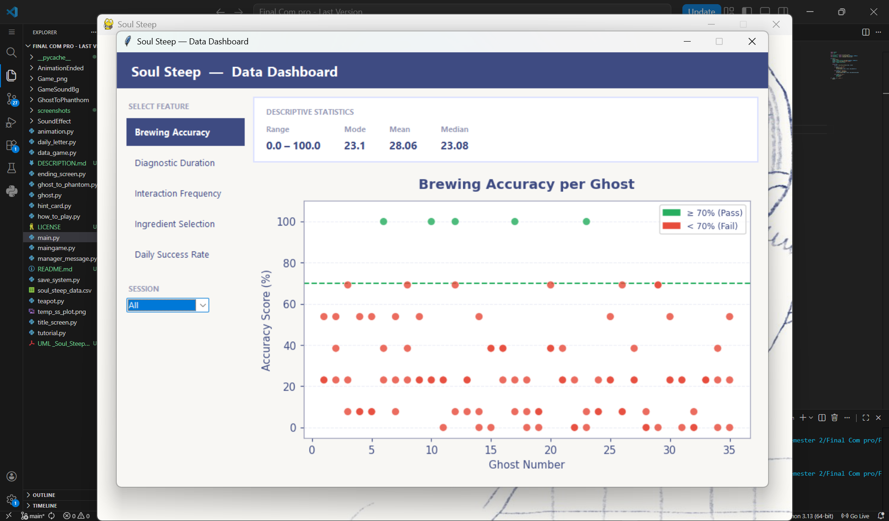
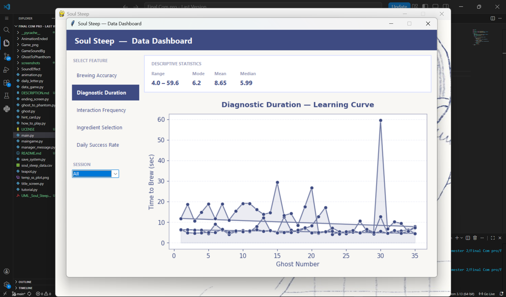
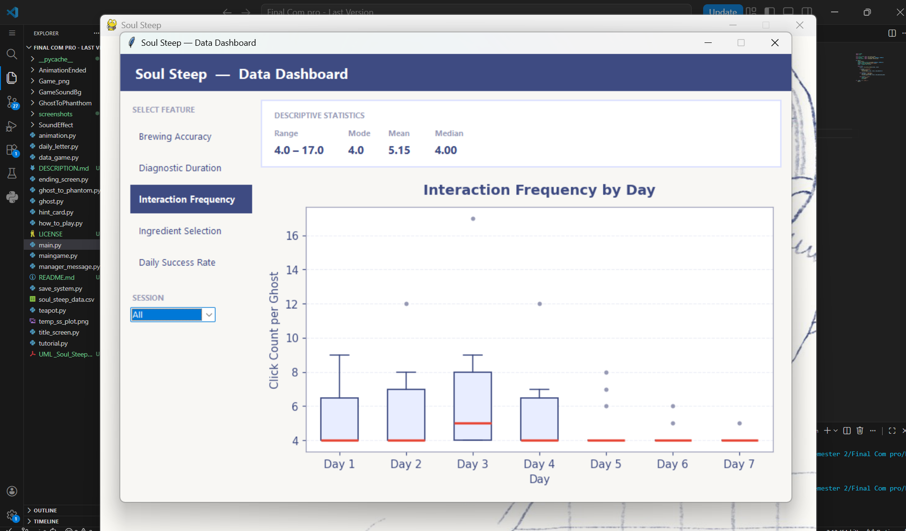
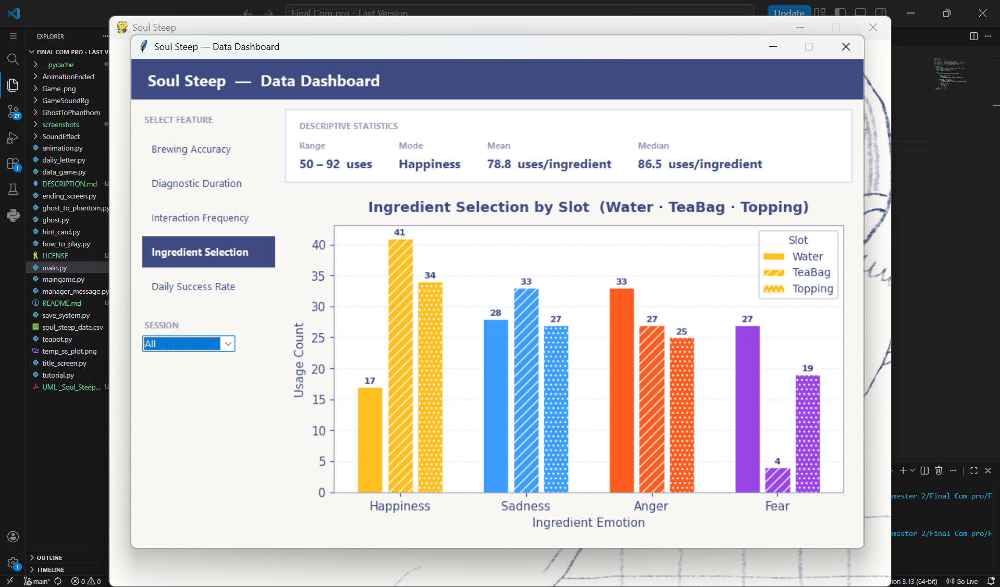

# Data Visualization
 
---
 
## Dashboard Overview
 
The Soul Steep Data Dashboard is built using tkinter and matplotlib. The left sidebar lets you select a data feature and filter by session. The right panel shows a Descriptive Statistics card (Range, Mode, Mean, Median) and the corresponding chart below it.
 
---
 
## Descriptive Statistics Card
 
The statistics card updates automatically when a feature or session is selected, displaying Range, Mode, Mean, and Median as a quick numerical summary of the data.
 
---
 
## Chart 1: Brewing Accuracy

 
A scatter plot where each dot is one brew — green for pass (≥70%), red for fail (<70%). The data shows most brews fall well below the 70% threshold line, indicating the diagnostic challenge is genuinely difficult.
 
---
 
## Chart 2: Diagnostic Duration

 
A line graph showing time spent per ghost across all sessions. Outliers above 300 seconds are removed. The Mean is 8.65 seconds and Median is 5.99, but visible spikes show some ghosts took significantly longer to diagnose.
 
---
 
## Chart 3: Interaction Frequency

 
A boxplot of click counts per ghost grouped by day. Days 1–3 show wider boxes and higher medians, while Days 5–7 are tighter and lower — showing players became more efficient as the internship progressed.
 
---
 
## Chart 4: Ingredient Selection

 
A grouped bar chart showing ingredient usage split by slot (Water, TeaBag, Topping). Happiness was selected most frequently, especially as Water (41 uses), while Fear was the least used across all slots.
 
---
 
## Chart 5: Daily Success Rate

 
A line graph of average accuracy per day. All dots are red — no day reached the 70% pass threshold — showing accuracy remained consistently low across all 7 days with no clear improvement over time.
